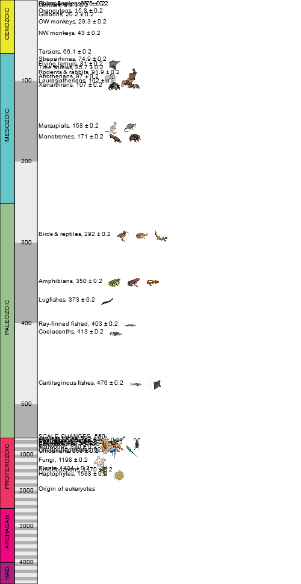
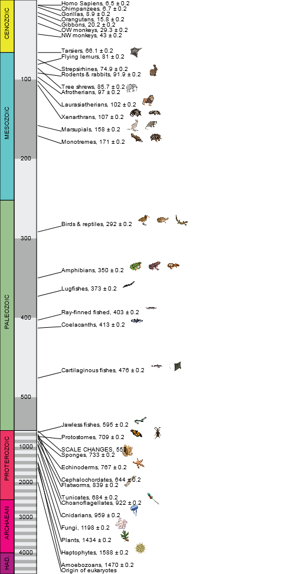

# Canvas Label Dodge
Turn  into !

Label regions on a canvas using normal canvas context drawing functions, automatically removing
overlap along the way.

## Example usage
```js
var canvas = ..., //
    ctx = canvas.getContext('2d');
var dodger = new LabelDodge(ctx);
dodger.lineToRow(function(ctx2) { // ctx2 provides the same operations as ctx but as dodged versions (currently only drawImage and fillText)
	
});
```

## Drawing operations (so far)
